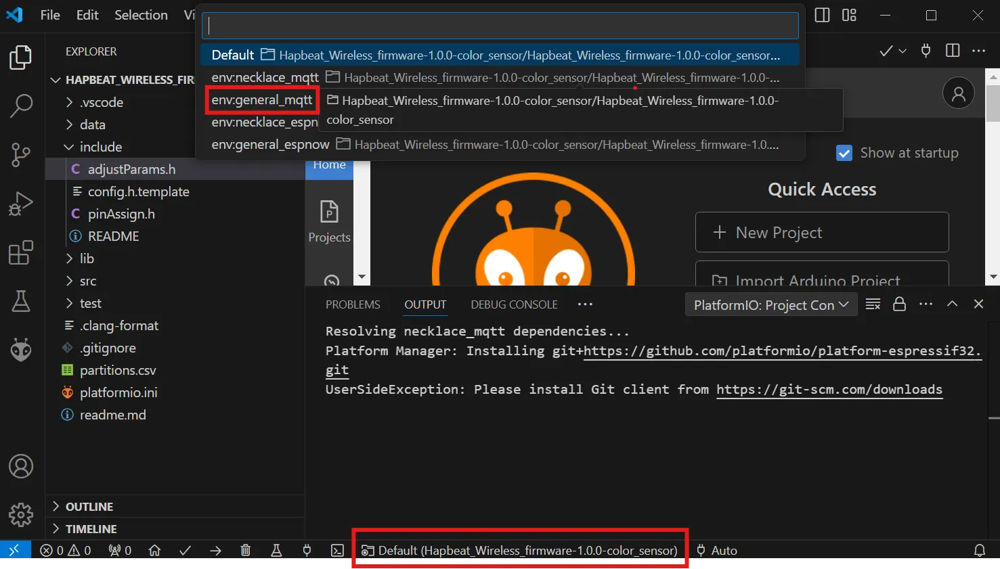
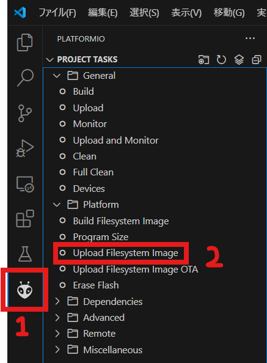
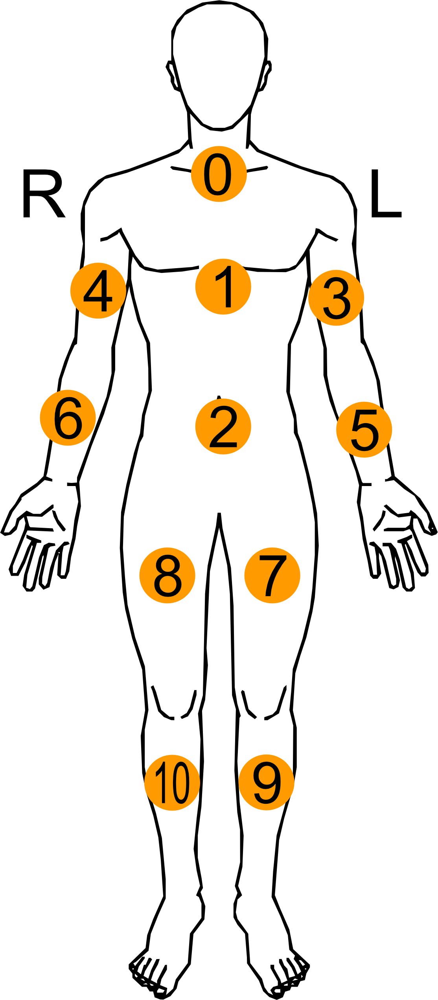

# Hapbeat Wireless Firmware

このリポジトリは、無線版 Hapbeat（Duo/Band 共通）のファームウェアです。本プロジェクトは、ESP32-S3 をベースにしており、ESP-NOW や MQTT などの通信プロトコルを活用した、デバイス間通信やインターネット接続機能を提供します。また、LittleFS を使用したファイルシステム管理や複数のセンサーデバイスへの対応も可能です。

## Quick Start (Duo Wireless & ESP-NOW の場合)

※ 事前に [git](https://git-scm.com/downloads), [VSCode](https://azure.microsoft.com/ja-jp/products/visual-studio-code) をインストールし、VSCode の拡張機能から [PlatformIO](https://platformio.org/install/ide?install=vscode) をインストールしてください。

1. リポジトリのクローン or zip ファイルダウンロード
2. Hapbeat を PC に接続し、**BOOT ボタンを押下したまま電源を ON**にし、認識されているか確認  
   （デバイスマネージャーで不明なデバイスと表示されなければ OK。ドライバインストールは不要）
3. VSCode の下部（画像赤枠）env:DuoWL_V3-ESPNOW を選択しビルド&書き込み
   
4. PlatformIO -> upload file image で dataフォルダ内にある wav データを Hapbeat にアップロード  
   
5. 電源を OFF->BOOT ボタンを押下しないで電源を ON

- UI が表示されているか確認
- （M5Stack basic の場合）ボタン押下で振動するか確認

## 必要な環境

**対応ハードウェア**:

- [Hapbeat Duo Wireless (DuoWL)](https://hapbeat.com/products/duo-wireless/)
- [Hapbeat Band Wireless (BandWL)](https://hapbeat.com/products/band-wireless/)

**ソフトウェア**:

- Windows OS（Mac でも動作するとは思いますがサポート対象外です）
- [PlatformIO](https://platformio.org/) IDE

# 各種パラメータ調整

## 画面 UI の変更

[`src/adjustParams.cpp`](https://github.com/yus988/Hapbeat_Wireless_firmware/blob/main/src/adjustParams.cpp)内の変数の値を用途に応じて調整してください。

## 振動用音声データの差し替え

[`data/`]フォルダ内の wav データを差し替えてください。ファイル名規則は次項を確認してください。

- 差し替えたら Quick Start にあるよう、platformIO -> upload file image で逐一アップロードし直してください。
- 拡張子は wav のみの対応となります。
- wav 形式は 符号付き 16bit（必須） / サンプルレート 8 kHz （16 kHz でも可）がおすすめです。
- 極力ファイルサイズを小さくするようにしてください。
  - 可能であればモノラル・1 ファイルにつき数百ミリ秒が目安です。

### ファイル名規則

ファイル名はハイフン区切りで以下の様な構成になっています。  
**category - soundID_subID - audioChannel - saveDistination - name**

- category: 再生するカテゴリを指定
- soundID: 音声データの種類
  - subID: 同じ soundID の差分データ。歩行音などの繰り返し再生する音声データにランダム性を付与したい場合に活用推奨
- audioChannel: C / L / R から指定。基本 C で、DuoWL で左右の振動強度を別々にしたい場合のみ L/R を指定。
  - C の場合はモノラル音源、L / R の場合は片方のチャンネルをミュートにしたステレオ音源を用意すること。
- saveDistination: RAM / FS からデータの保存先を指定。
  - RAM: 内部 RAM に保存。応答性を重視するファイルは RAM を選択すること。ただしサイズ制限が厳しいため１ファイル 100KB 以下、RAM 全体で 500KB 以内が目安。
  - FS: ファイルストレージに保存。RAM に比べサイズに余裕があるが、呼び出しに時間が掛かる（数百ミリ秒程度）ため、ループ音源などリアルタイ性が求められないもの推奨。FS 全体で 2MB 以内が目安。
- name: 人間が読む用の名前。プログラム上では無視される。

例：0-0_1-C-RAM-gunshot.wav というファイルに対して、読み込まれるパラメータ

- category = 0
- sound_id = 0
- sub_id = 1
- audio_channel = C
- data_storage = RAM

### 最大データ数

[`lib/audioManager/audioManager.h`](https://github.com/yus988/Hapbeat_Wireless_firmware/blob/main/lib/audioManager/audioManager.h)の調整項目を参照してください（将来的に adjustmentParams.cpp にまとめます）

## 送受信データ形式説明

コンマ区切りのテキストデータ（例 "0,0,99,0,0,100,100,0"）を受信することで、以下の内容にパースしデータの可否や再生する wav データ、音量の選択を行います。

### **{category, channel, position, sound_id, sub_id, volume_L, volume_R, playtype}**

- category: **0--設定最大値**の整数値。 受信カテゴリ（ゲーム、動画など別々のコンテンツを 1 台で担いたい場合に分別）
- channel: **0--255**の整数値。受信チャンネル（player A / B / C など同一コンテンツで別々のチャンネルを設けたいときに分別）
- position: **0--255**の整数値。受信する装着位置（DuoWL:首＋ BandWL:手首など、1 人が複数の Hapbeat を装着する場合に分別）
  - それぞれ `99` を指定することで受信側の設定に関わらず常に再生させることができます。
    - 例：category = 99 とすることで、受信側の category 設定に関わらず再生
  - 上記 3 つは機能的には同等です。
- sound_id: **0--設定最大値**の整数値。音声ファイルの種類、カテゴリごとに独立
- sub_id: **0--設定最大値** 同じ soundID の差分データ。歩行音などの繰り返し再生する音声データにランダム性を付与したい場合に活用推奨。
- volume_L, R: **0--255** の整数値。左右の再生音量を指定。L=R の場合、モノラル、L≠R の場合ステレオと認識。ステレオの場合、左右それぞれの音声ファイルが必要であることに注意。
- playtype: **0--3** の整数値。各トラックで同時に再生できる音声は1種類のみ。
  - 0 = oneshot: 対象を 1 回のみ再生（トラック０）
  - 1 = loopStart: 対象をループ再生（トラック１）
  - 2 = loopStop: ループ再生を停止（トラック１）
  - 3 = oneshot(2ndline): 対象を 1 回のみ再生（トラック２）
    - oneshotを同時に複数出したい場合にご利用ください。

## 装着位置早見表

実際は開発者側が自由に選べますが、Hapbeat 社では以下を基準としています。

---

---

### 使用ライブラリ

このプロジェクトは以下のライブラリを使用しています。各ライブラリはそれぞれのライセンスに基づいて提供されています。

| ライブラリ名                         | ライセンス         | リンク                                                                   |
| ------------------------------------ | ------------------ | ------------------------------------------------------------------------ |
| **Adafruit SSD1306**                 | BSD ライセンス     | [GitHub](https://github.com/adafruit/Adafruit_SSD1306)                   |
| **efont Unicode Font Data**          | Apache License 2.0 | [GitHub](https://github.com/tanakamasayuki/efont-unicode-font-data)      |
| **ESP8266Audio**                     | LGPL v2.1          | [GitHub](https://github.com/earlephilhower/ESP8266Audio)                 |
| **FastLED**                          | MIT ライセンス     | [GitHub](https://github.com/FastLED/FastLED)                             |
| **MQTT (256dpi)**                    | MIT ライセンス     | [GitHub](https://github.com/256dpi/arduino-mqtt)                         |
| **Soldered MCP4018 Arduino Library** | MIT ライセンス     | [GitHub](https://github.com/SolderedElectronics/MCP4018-Arduino-Library) |

### ライセンス情報

このプロジェクトで使用されるライブラリのライセンス情報は `LICENSES` フォルダに含まれています。詳細は各ライセンスファイルを参照してください。
